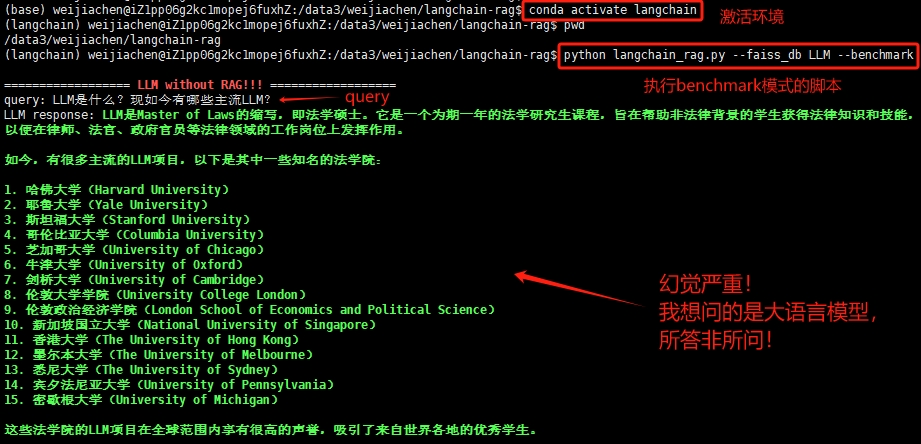
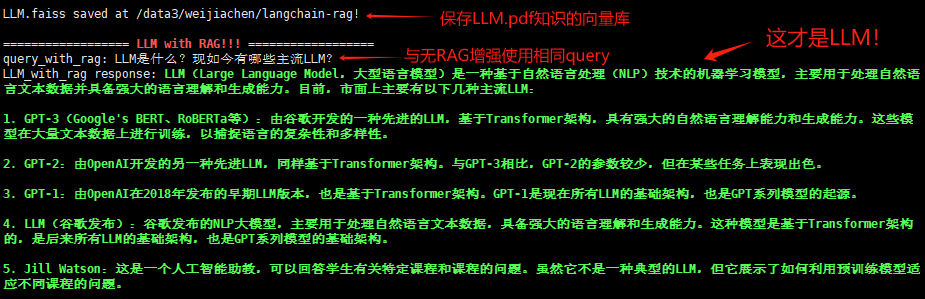
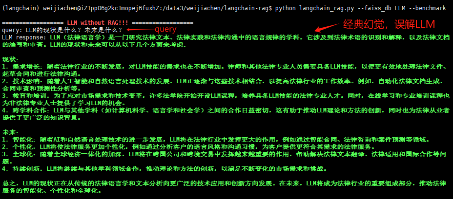
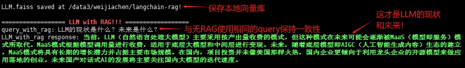
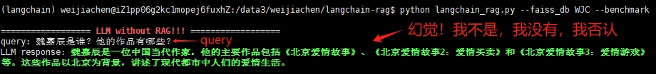
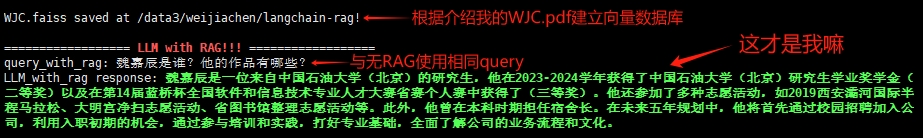
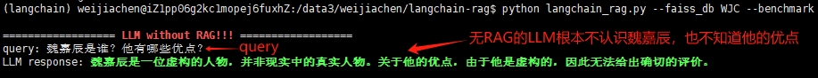
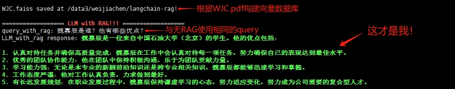

# 基于LangChain实现RAG检索应用

本repo的预训练大模型使用modelscope社区的对中文效果更好的Baichuan2-7B-Chat，结合langchain实现RAG检索增强。Linux服务器系统为Ubuntu 22.04，计算卡为NVIDIA A40-40g。

## 依赖

1、构建并激活conda虚拟环境，使用Python3.10

```
conda create -n langchain python=3.10
conda activate langchain
```

2、确保CUDA已安装完毕（推荐CUDA12.1），若没有请执行

```
wget https://developer.download.nvidia.com/compute/cuda/12.1.0/local_installers/cuda_12.1.0_530.30.02_linux.run
sudo sh cuda_12.1.0_530.30.02_linux.run
```

3、安装PyTorch-2.4.1（最新版本，本demo中并无bug）

```
# 使用清华源加速下载，实测从清华源下载的默认就是CUDA12.1的gpu版本pytorch
pip install torch==2.4.1 torchvision==0.19.1 torchaudio==2.4.1 -i https://pypi.tuna.tsinghua.edu.cn/simple
```

4、安装其余依赖，如langchain、modelscope、transformers等，向量数据库使用的是faiss-cpu向量数据库，用于存放我们提供的pdf中的内容，若pdf中包含图片，请额外安装rapidocr-onnxruntime实现OCR识别

```
# 注意是modelscope[framework]，否则会丢失一些底层包
pip install langchain huggingface_hub pypdf rapidocr-onnxruntime modelscope[framework] transformers sentence_transformers faiss-cpu tiktoken accelerate bitsandbytes -i https://pypi.tuna.tsinghua.edu.cn/simple
```

## 用法

1、请确保将外部PDF放入本demo的项目根目录，本demo中事先提供了两个，分别是LLM.pdf介绍LLM相关知识，和WJC.pdf介绍本人（魏嘉辰）的个人简介及相关信息（无隐私内容）

2、直接运行完整端到端python脚本（无需第3步）langchain_rag有两个可选命令行参数，其一是--faiss_db，接收格式为字符串，为提供的PDF的文件名（不包括后缀），稍作等待即可开始与RAG增强过的LLM进行多轮对话，输入中包含“bye”或“再见”时即中止；其二是--benchmark，类型为bool，显式给出即为True，此时会先运行无RAG的LLM，然后再运行有RAG的LLM，可以显式对比相同query下的response（保证query完全一致效果更明显），benchmark下只会各进行一次对话，用作效果对比。

```
# 如下RAG测试用例建议使用WJC效果更好，毕竟WJC是一个名不见经传的小人物，但是LLM的知识他自己肯定知道一些
python langchain_rag.py --faiss_db WJC
# python langchain_rag.py --faiss_db LLM
python langchain_rag.py --faiss_db WJC --benchmark
# python langchain_rag.py --faiss_db LLM --benchmark
```

3、indexer.py可以解析pdf生成向量库（仅会在根目录生成PDF对应的XXX.faiss向量库，不会执行LLM，仅做演示和调试用。完整代码langchain_rag.py也可根据控制台输入生成对应向量库）

```
python indexer.py
```

## 测试用例及效果展示

### Benchmark模式

1、使用 ***LLM.pdf*** 检索增强效果对比（差别不明显，因为本身预训练模型就有LLM的知识，但是如果对比LLM.pdf中的内容还是能直观看出RAG检索增强的更具体更准确）

测试用例：  

a. LLM是什么？现如今有哪些主流LLM？  

无RAG检索增强效果展示（详细见图）：  
  
有RAG检索增强效果展示（详细见图）：  
  

b. LLM的现状是什么？未来是什么？  

无RAG检索增强效果展示（详细见图）：  
  
有RAG检索增强效果展示（详细见图）：  
  

2、使用 ***WJC.pdf*** 检索增强效果对比（效果明显，因为预训练模型训练的时候肯定没“见过我”）

测试用例：  

a. 魏嘉辰是谁？他的作品有哪些？  

无RAG检索增强效果展示（详细见图）：  
  
有RAG检索增强效果展示（详细见图）：  
  

b. 请介绍一下魏嘉辰的个人优势。  

无RAG检索增强效果展示（详细见图）：  
  
有RAG检索增强效果展示（详细见图）：  
  

### 多轮对话模式

1、使用 ***WJC.pdf*** 检索增强效果对比（效果明显，此处省略LLM.pdf）  

测试用例（多轮连续对话的测试用例为a-d，e用来测试应用的自动退出，代码中的逻辑为在对话过程中只要query出现“bye”或“再见”等字眼，程序会在大模型答复该query后自动退出）：  

a. 请您简单介绍一下魏嘉辰。  
b. 他在本科和研究生阶段的所学课程分别有哪些？  
c. 请简要介绍他的获奖情况。  
d. 请结合他的实习经历，简单说一说你觉得他更适合做哪些方面的工作？  
e. 谢谢您的回答，再见~  
  
